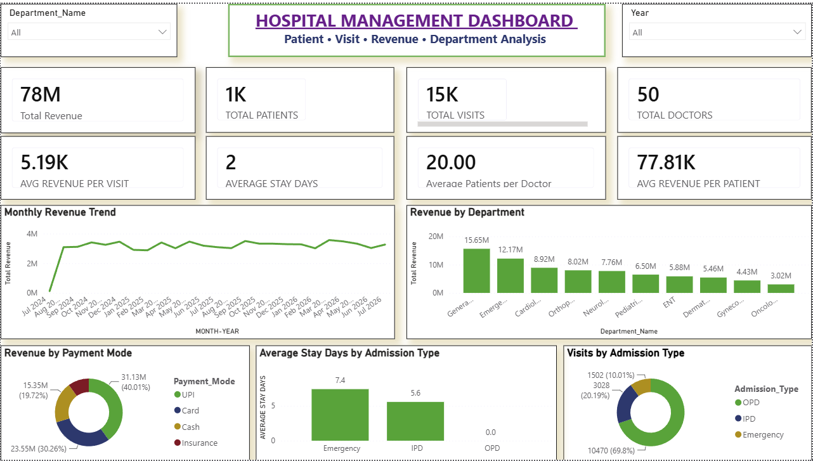

# Hospital Management Dashboard

## About the Project

I created this project to understand how hospital data can be analyzed using SQL and Power BI.

The main goal was to get a clear view of hospital visits, patients, doctors, revenue, departments and admission types in one dashboard.

I worked with the data in SQL first and then used Power BI to build the final interactive dashboard.

## Tools Used

- PostgreSQL
- SQL
- Power BI
- Excel / CSV

## Project Areas

The dashboard focuses on:

- Total Revenue
- Total Patients
- Total Visits
- Total Doctors
- Average Revenue per Visit
- Average Stay Days
- Average Patients per Doctor
- Average Revenue per Patient
- Monthly Revenue Trend
- Revenue by Department
- Revenue by Payment Mode
- Average Stay Days by Admission Type
- Visits by Admission Type

## Dashboard Features

- Department filter
- Year filter
- KPI cards
- Monthly revenue trend
- Department-wise revenue analysis
- Payment mode analysis
- Admission type analysis

## Dashboard Preview



## Dataset

The `Dataset` folder contains the files used for the project:

- Departments.csv
- Doctors.csv
- Patients.csv
- Visits.csv
- Hospital Dataset Blueprint

[View Dataset](Dataset/)

## SQL Analysis

The SQL analysis used in this project is available in:

[View SQL Analysis](Hospital_Management_SQL.sql)

The SQL file contains the queries used to analyze and prepare the hospital data for the dashboard.

## Power BI Dashboard

The Power BI dashboard file is available here:

[View Power BI Dashboard](Hospital_Management_Dashboard.pbix)

## Project Structure

```text
Hospital-Management-Dashboard
│
├── Dataset
│   ├── Departments.csv
│   ├── Doctors.csv
│   ├── Patients.csv
│   ├── Visits.csv
│   └── Hospital_Dataset_BLUEPRINT.xlsx
│
├── Hospital_Management_Dashboard.pbix
├── Hospital_Management_SQL.sql
└── README.md
